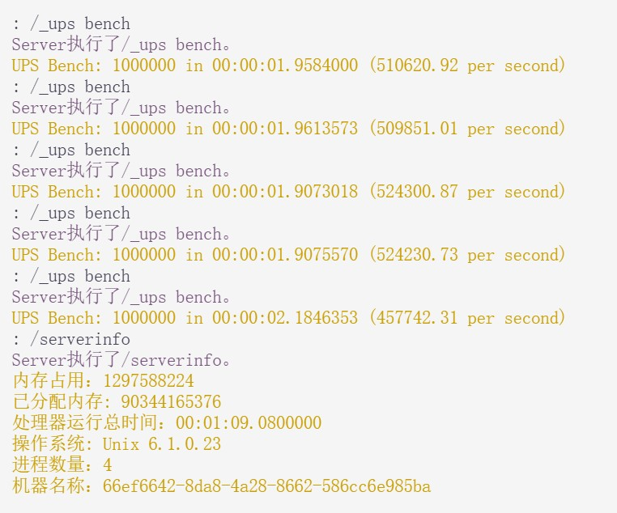

## 前言

测试方式：均为两名玩家，半夜测试，玩家进入后先执行几遍指令，10秒后执行5次指令并且记录。测试内容为随机选择地图上1000000个方块来更新比时间，尽量控制了变量，地图存档，插件等均相同。

## CPU 性能天梯图
| 排名 | CPU 型号                  | 性能分数    | 测试内容                                                                 |
|------|--------------------------|-------------|--------------------------------------------------------------------------|
| 1    | 简幻欢 R9-9900X 9950X   | 1249229.490 |  S（R9-9900X/9950X）.A.M.L 4核8g 25G（硬盘）170积分 |
| 2    | 简幻欢 R9-7900X 7950X   | 1137226.23  |  S-（R9-7900X/7950X）.A.M.L 4核8g 25G（硬盘）145积分 |
| 3    | 简幻欢 I9-13900K, I7-14700K | 1095073.400 |  S（I9-13900K,I7-14700K）.I.M.L 4核8g 25G（硬盘）170积分 |

| CPU 型号                                  | 性能分数      |
|------------------------------------------|---------------|
| 简幻欢 R9-9900X 9950X                   | 1249229.490   |
  
S（R9-9900X/9950X）.A.M.L 4核8g 25G（硬盘）170积分

| 简幻欢 R9-7900X 7950X                   | 1137226.23    |
  
S-（R9-7900X/7950X）.A.M.L 4核8g 25G（硬盘）145积分

| 简幻欢 I9-13900K, I7-14700K             | 1095073.400   |
  
S（I9-13900K,I7-14700K）.I.M.L 4核8g 25G（硬盘）170积分

| Loguhan的 AMD Ryzen 5 5500               | 945001.978    |
  
Loguhan的 AMD Ryzen 5 5500

| 简幻欢 I7-12700K,I7-13700K               | 939637.550    |
  
S-（I7-12700K,I7-13700K）.I.M.L 4核8g 25G（硬盘）145积分

| 简幻欢 R9-5900X, R9-5950X               | 829916.660    |
  
A（R9-5900X/5950X）.A.M.L 4核8g 20G（硬盘）130积分

| 羽学 R7-4800H                           | 839295.236    |
  
羽学哥哥的电脑

| 熙恩 R7-5700U                           | 715876.960    |
  
我自己的电脑

| 腾讯云 AMD EPYC 7K62 48-Core Processor 2.60 GHz | 585560.768    |
  
腾讯云特惠机器 忘记几百3年了

| 简幻欢 EPYC 7C13, EPYC 7B13, EPYC 7713  | 585560.768    |
  
B+（EPYC 7C13/7B13/7713）.A.L.L 4核16g 16G（硬盘）85积分

| 雨云 E5-2666v3                          | 557747.384    |
  
每天签到500积分，简单的一次性积分共8000，2000积分领取7天，免费续期7天2258  
配置 E5-2666v3 动态计费（他里面有电量），2 vCPU 4 GB 10 GB（磁盘）20 Mbps 100 Mbps（上下）  
个人测试体验 面板很流畅，有自定义启动脚本，感觉不错，后续测试 大师FTW大世界1天7人左右下来大概在1000电量左右（等于积分500），而且会出现奇怪的问题，测试服主发现 玩家有时候会莫名断连，但是后台未显示玩家被踢出，手动踢出后，大部分玩家也无法再次进入，并且后台没有玩家的链接请求，在简幻欢测试不会出现这种情况，大概率是雨云的问题

| Intel(R) Xeon(R) Platinum 8124M CPU @ 3.00GHz | 506865.884    |
 Xeon(R) Platinum 8124M CPU @ 3.00GHz.jpg)  
喵云S4

| 简幻欢 E5-2690v4,铂金8175M,金牌6148     | 505349.168    |
  
B-（E5-2690v4,铂金8175M,金牌6148）.I.M+.L 4核12g 16G（硬盘）60积分

| 简幻欢 E5-2682v4                        | 454498.988    |
  
C+（E5-2682v4）.I.M+.L 4核12g 16G（硬盘）50积分

| 简幻欢 E5-2696v2, E5-2697v2             | 393140.364    |
  
C（E5-2696v2或E5-2697v2）.I.L.L 4核16G 16G（硬盘），50积分

| wemc 未知配置                           | 344878.558    |
  
个人使用体验：各种奇怪的小问题，而且他们的启动脚本太怪了，还不好自定义启动脚本（你不好碰到他们的脚本）

| 简幻欢 铂金8151                         | 288840.012    |
  
B++（铂金8151）.I.L.L4核16g 20G（硬盘）95积分

| 简幻欢 金牌6140                         | 199229.238    |
  
C++（金牌6140）.I.M.L 4核8G 16G（硬盘），50积分

| 简幻欢 铂金8124 8124M                   | 197233.306    |
  
B（铂金8124/8124M）.I.M.L 4核8g 16G（硬盘）70积分
